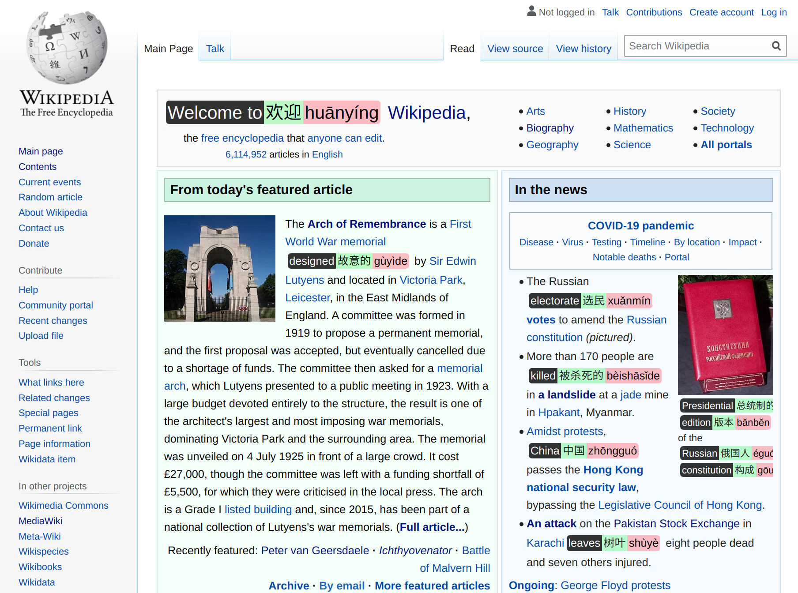

# Word Annotations Chrome Extension

This extension replaces English words with translations so that you may become
enlightened with random vocabulary.

#### Basic usage

To install, navigate to `chrome://extensions` in a new tab in Chrome. Drag and
drop the `extension` directory in this repository into the Chrome window.

Press the extension icon or the Right-Ctrl key to trigger the replacement.
Hover over annotations to show tooltips (e.g., additional translations). To
exclude a word from future annotations, click on an annotated word.

The default settings, may result in an overwhelming amount of matches. To reduce
the density of matches in a text, use the density slider in the icon menu.

#### Description of code

`extension/load.js` is run on each page. It traverses the DOM and replaces words
with known translations with the annotations when `annotate()` is called.
`extensions/vocab.json` holds the current vocabulary in use by the extension.

By default, the extension is active on all pages. Edit `"matches":
["<all_urls>"]` in `extensions/manifest.json` to restrict the domains.
Alternatively, set site access permissions inside Chrome.

#### Changing the vocabulary

Run `unzip datasets.zip` to extract the source data sets.

Run `python3 setup.py <vocab_file>` to generate a new `extension/vocab.json`
file, with a custom vocabulary. The default vocabulary is an English-Chinese
dictionary generated by: `python3 setup.py ecdict`.

###### Other options include:
* `countries` (country names in Chinese)
* `ecdict` (English-Chinese; excluding categorical terms like medicine, tech)
* `ecdict-full` (English-Chinese; full dictionary)
* `ejdict` (English-Japanese; seems to be inaccurate...)
* "a custom CSV file" (see `datasets/countries.csv` for an example)

#### Improvements/TODO
* add new words in browser popup
* use POS tags to do WSD
* change language settings without reloading
